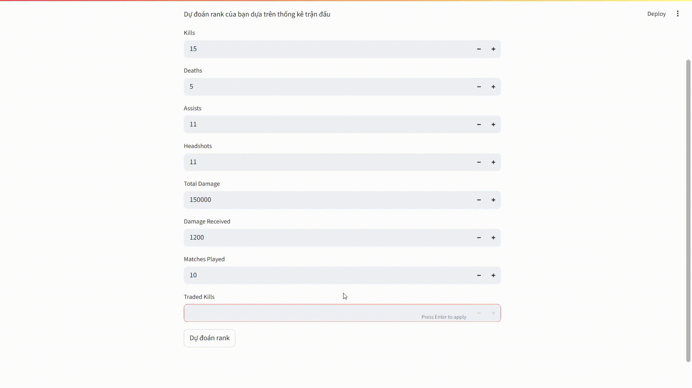
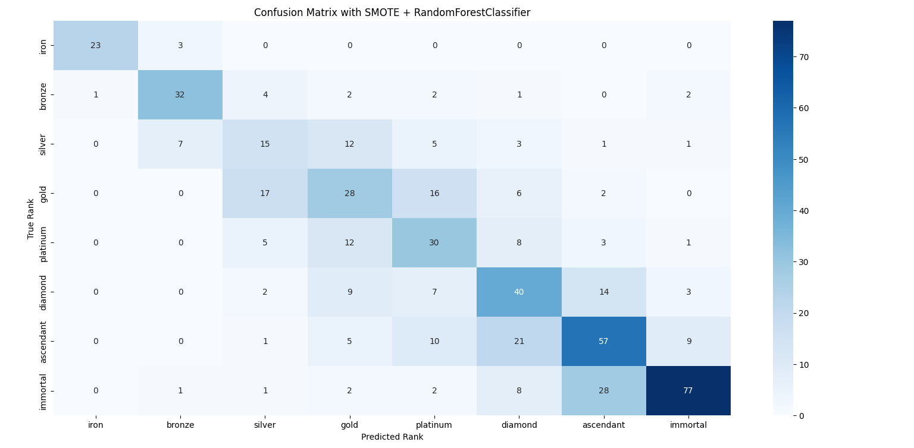

# 🎯 Valorant Rank Predictor

This project uses a machine learning model to **classify a Valorant player's rank** based on in-game statistics such as kills, deaths, assists, headshots, damage received, etc.

A mini web demo using **Streamlit** is included for easy experimentation.

---

## 🖥️ Demo


---

## 🚀 Project Goals

- Build a model to classify a player's rank from match statistics.
- Explore the relationship between individual performance and rank.
- Practice a full ML pipeline: preprocessing → training → evaluation → web deployment.

---

## 🧠 Model Used

- `RandomForestClassifier` from `sklearn`.
- **SMOTE** technique applied to balance the training dataset.
- Hyperparameter tuning using `GridSearchCV`.

Key engineered features include:
- KDA ratio
- Headshot rate
- Damage dealt/received
- Survival rate, etc.

---

## 📊 Results & Insights

> The model performs well on low (**iron**, **bronze**) and high (**immortal**) ranks, but struggles with mid-tier (**silver → platinum**) classifications.  
> This reflects real gameplay, where middle ranks often vary due to inconsistent performance or team impact.

- **Average F1 Macro Score: ~0.58**
- **Accuracy: ~56%**
- **R² is not used as this is a classification task**
- Dataset was balanced using `SMOTE` to improve fairness and performance.



---

## 📁 Folder Structure

```
valorant_rank_predictor/
├── app.py                 # Streamlit web interface
├── model/
│   └── rf_classifier.pkl  # Trained RandomForest model
├── data/
│   └── valorant_dataset.csv  # Input dataset
├── pic/
│   └── Confusion_Matrix.png  # Confusion matrix image
│   └── demo.gif
├── requirements.txt       # Required Python libraries
└── README.md              # Project description
```

---

## ▶️ How to Run

### 1. Install dependencies
```bash
pip install -r requirements.txt
```

### 2. Launch the web app
```bash
streamlit run app.py
```

---

## ⚙️ Techniques Applied

- Data cleaning: fixing incorrect numeric formatting (e.g., "1,200" → "1200")
- Data normalization using `StandardScaler`
- Dataset balancing with `SMOTE`
- Model training using `RandomForestClassifier`
- Hyperparameter tuning via `GridSearchCV`
- Evaluation using `confusion matrix` and `classification_report`
- Visualization with `Seaborn`

---

## 📌 Notes

- The original dataset is slightly imbalanced towards higher ranks, but SMOTE was applied to fix this.
- Performance can be further improved by adding map, agent, or time-series features.

---

## 💡 Future Ideas

- Track rank progression over time
- Predict MVP or win probability
- Recommend optimal agents based on current stats

---

## 👨‍💻 Author

- Name: Pea
- Contact: nnphuc2201@gmail.com